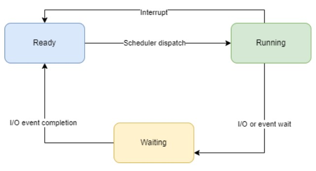
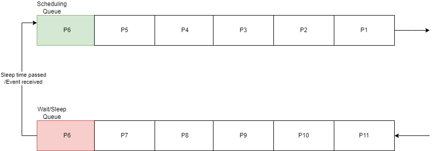

# Devoir 3 - Planificateur

Le but de ce devoir est de créer un planificateur de processus. Il doit utiliser trois algorithmes de planification:
* Round Robin
* Round Robin avec des priorités
* Complete Fair Scheduler (CFS)

## Informations générales
:::info
Date limite: **14 mai, 23:59**\
Points: **2 points** de la note finale\
Lien: [Devoir 3 - Planificateur](https://classroom.github.com/a/vnaIgFAJ)\
Télécharger en retard: **1 points / jour** (maximum 4 jours)
:::

## Connaissances évaluées
* Comprendre le fonctionnement du planificateur
* Implémenter des algorithmes de planification
* Comprendre le système de processus

## Règles
1. Le devoir doit contenir un fichier nommé Readme.md avec des explications concernant la manière choisie pour résoudre le devoir (-0.1p)
2. Le devoir doit être implémenté en Rust et seulement en utilisant des fonctions de la bibliothèque standard Rust. Toute autre implémentation conduira à l'annulation du devoir.(**0 points**)
 :::tip
 Exception: Vous pouvez utiliser la bibliotheque [chrono](https://docs.rs/chrono/latest/chrono/) pour l'affichage de date et heure et la bibliotheque [regex](https://docs.rs/regex/latest/regex/) pour le bonus.
 :::

 ## Copiage
 Le devoir est individuel. Toute tentative de copier entraînera **0p** pour les devoirs. On utilisera un système automatisé pour détecter le copiage. Si on a des doutes, on va vous adresser des questions supplémentaires concernant le devoir.

 ## Questions
 Si vous avez des questions concernant le devoir, posez-les en publiant un issue sur le github https://github.com/UPB-FILS-SdE2/questions avec le format [scheduler] "le titre de votre question" . Vous aurez besoin d'un compte github pour publier des questions.

  :::danger
  **NE PUBLIEZ PAS DE CODE SOURCE**. Cela est considéré comme copiage et vous aller recevoir **0p** pour le devoir.
  :::

  Si vous voulez recevoir un e-mail lorsque des problèmes sont signalés ou lorsqu'il y a de nouveaux messages, accédez au site [github repository](https://github.com/UPB-FILS-SdE2/questions) et cliquez sur Watch.

## Planificateur
Le planificateur fait partie du système d'exploitation. Parce que l'écriture de code dans le système d'exploitation est difficile, un simulateur de processus a été déployé dans l'espace utilisateur.

Implémentez un **planificateur** de processus qui contrôlera leur exécution dans l'espace utilisateur. Il simulera un planificateur de processus préemptif, dans un système monoprocesseur, qui utilise un algorithme de planification Round Robin, Round Robin avec des priorités et CFS.

Pour chaque planificateur, vous devez **implémenter** le trait `Scheduler`. Cela signifie mettre en œuvre les trois fonctions:
* `next` - le prochain processus à exécuter
* `stop` - recevoir des informations sur la raison pour laquelle le processus s'est arrêté
* `list` - retourner l'état des processus

Pour cela, vous pouvez créer des fichiers séparés pour chaque planificateur et exportez-le dans `scheduler/src/schedulers/mod.rs`.

:::warning
Vous devez implémenter le trait `Scheduler` pour les 3 algorithmes de planification et **rien d'autre**. Les autres informations présentées ci-dessous sont des détails de mise en œuvre du modèle existant, afin que vous compreniez mieux le fonctionnement du planificateur
:::

### Temps d'exécution
Dans un système réel, pour le contrôle d'exécution, le comptage du temps d'exécution d'un processus est effectué à chaque interruption d'horloge.

Pour faciliter la mise en œuvre, le modèle de thème simulera un système réel comme celui-ci :
* Le système simulé utilisera un temps virtuel (logique) indépendant du temps réel pour compter le temps de fonctionnement sur le processeur.
* Vous considérerez qu'une instruction dure une seule période d'horloge (unité de temps logique).
* Chacune des fonctions présentées ci-dessus représente une seule instruction exécutable par un processus à un instant donné.

### Crate scheduler
Cette bibliothèque fournit les traits et les structures nécessaires à la mise en œuvre d'un planificateur de processus.

#### enum ProcessState
Cette énumération contient les états possibles d'un processus pour notre simulation:
* **Ready** - Le processus attend d'être planifié
* **Running** - Le processus est planifié
* **Waiting** - Attend après un événement ou une opération d'E/S

#### enum SchedulingDecision
Cette énumération contient l'action que le planificateur demande au système d'exploitation de prendre. Il représente également la valeur renvoyée par la fonction `Scheduler::next` que vous devez implementer:
* **Run `{pid, timeslice}`** - Exécutez le processus avec PID pid pour un maximum d'unités de temps de tranche de temps
* **Sleep(time_units)** - Dormez le nombre d'unités de temps spécifiées
* **Deadlock** - Le système d'exploitation ne peut plus continuer, car tous les processus attendent des événements. Dans ce cas, aucun autre processus ne peut envoyer d'événements, ce qui signifie que tous les processus attendront indéfiniment.
* **Panic** - Le processus avec le PID 1 s'est arrêté.
* **Done** - Il n'y a plus de processus à planifier.

#### enum StopReason
Cette énumération contient la raison pour laquelle un processus s'est arrêté et le système d'exploitation a appelé le planificateur:
* **Syscall `{syscall, remaining}`** - Le processus a envoyé un appel système de type `Syscall`; `remaining` represent le nombre d'unités de temps que le processus n'a pas utilisé à partir de ses quanta
* **Expired** - La tranche de temps allouée au processus a expiré et le processus a été préempté

#### enum Syscall
Cette énumération contient les appelles système que les processus effectuent vers le planificateur:
* **Fork(process_priority)** - Créez un nouveau processus et renvoyez son PID.
* **Sleep(amount_of_time)** - Demander au planificateur de suspendre le processus pendant un certain temps
* **Wait(event_number)** - Le processus sera placé dans `ProcessState::Waiting` jusqu'à ce qu'un autre processus émette un appel système `Syscall::Signal` avec ce numéro d'événement.
* **Signal(event_number)** - Tous les processus qui attendent cet événement seront réveillés et placés dans l'état `ProcessState::Ready`.
* **Exit** - Demandez au planificateur de terminer le processus. Le processus ne sera plus jamais planifié et sera supprimé de la liste des processus dont le planificateur assure le suivi.

#### enum SyscallResult
Cette énumération contient le résultat renvoyé par un appel système:
* **Pid(pid)** - Le PID du nouveau processus. Renvoyé après un appel système `Syscall::Fork`
* **Success** - L'appel système a réussi.
* **NoRunningProcess** - L'appel système a été émis alors qu'aucun processus n'était planifié.

### Processor library
Cette bibliothèque est utilisée pour simuler le planificateur à partir de la crate **scheduler**.

#### ProcessInfo struct
Contient les informations suivantes sur un processus:
* Pid
* State
* Timings - temps total, temps d'appel système, running time

#### Simulateur de processeur
Le simulateur utilise les fonctions suivantes:
* **fork** - Envoie un appel système `Syscall::Fork`
* **exec** - Exécuter une unité de temps.
* **wait** - Envoie un appel système `Syscall::Wait`
* **signal** - Envoie un appel système `Syscall::Signal`
* **sleep** - Envoie un appel système `Syscall::Sleep`
* **exit** - Arrête le processus; le processus informe le système d'exploitation qu'il a terminé son exécution

:::warning
Le premier appel de fonction dans le planificateur doit être un **fork**, afin de créer le premier processus, sinon nous aurons une erreur.
:::

## Algorithmes de planification
:::note
Pour plus de détails sur la mise en œuvre, veuillez consulter les commentaires du fichier `scheduler/src/lib.rs` pour chaque algorithme.
:::

### Round Robin
Pour cet algorithme, tous les processus ont la même priorité et sont planifiés les uns après les autres. Après qu'un processus a été planifié, il sera placé au bout de la queue.

L'algorithme round Robin consiste en 2 files d'attente, la file d'attente de planification et la file d'attente d'attente/veille.
1. La file d'attente de **planification** contient tous les processus prêts à être planifiés, en conservant ceux qu'ils ont dans la file d'attente. Il n'y a pas de priorités particulières.
2. La file **d'attente/veille** contient tous les processus qui ont effectué un appel système et attendent un certain événement ou la fin de leur temps de veille; les processus seront mis dans la file d'attente dans l'ordre où ils ont dormi

Les nouveaux processus seront placés **à la fin** de la file d'attente.

Les processus sont récupérés de la file d'attente/veille et poussés à la fin de la file d'attente de planification dans les situations suivantes:
* À chaque **itération de planification**, une vérification est effectuée pour voir si le temps de sommeil de chaque processus dans la file d'attente est écoulé ; si tel est le cas, les processus sont récupérés de la file d'attente
* Si un **signal** est reçu, indiquant qu'un certain événement a été déclenché, chaque processus de la file d'attente qui attendait ce signal sera récupéré, en respectant son ordre, et placé à la fin de la file d'attente de planification

#### Round Robin avec des priorités
Cet algorithme est identique au précédent, avec la modification suivante: la priorité initiale du processus est celle qu'il reçoit à la **fork**. Cette priorité **ne peut jamais** être surmontée. Chaque fois qu'un processus dépasse son temps, il est pénalisé de 1. À chaque fois le processus se termine avant de dépasser son quantum, il est récompensé par 1.

La priorité ne peut être inférieure à 0 ni supérieure à 5.

Lors de la planification, seuls les processus ayant la priorité la plus élevée sont pris en compte. Si aucun d'entre eux ne peut être planifié (sont en veille), envisagez des processus moins prioritaires. S'il n'y a ni l'un ni l'autre ici être planifié, tenir compte des éléments suivants, etc.

#### Completely Fair Scheduler
Cet algorithme est utilisé par Linux. Vous pouvez trouver plus de détails sur [CFS](https://opensource.com/article/19/2/fair-scheduling-linux): une planification de processus parfaitement juste sous Linux. La variante implémentée ici prendra en compte:
* virtualtime
* la quante de temps variable en fonction du nombre de processus, le temps réel est le temps initial divisé par le nombre de processus, le temps de référence ne peut être inférieur à 1.

Dans CFS, le processus qui a le plus petit `vruntime` sera le prochain planifié. S'il y a 2 processus qui ont le même `vruntime`, celui avec le **plus petit PID** sera planifié ensuite.

:::note
Apres chaque exécution d'un processus on va ajouter le numéro d'unités de traitement exécutées par le processus a `virtualruntime` (la valeur est en fait quantum_temps - process.quantum).
:::