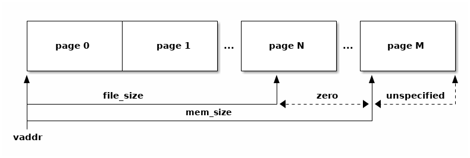

# Devoir 4 - Chargeur d'exécutable

## Informations générales
:::info
Date limite: **2 juin, 23:59**\
Points: **2 points** de la note finale\
Lien: [Rustyloader](https://classroom.github.com/a/emMZvU8G)\
Télécharger en retard: **1 points / jour** (maximum 4 jours)
:::

## Connaissances évaluées
 - Apprendre comment un exécutable est chargé et exécuté par le système d'exploitation.
 - Acquérir des compétences pour travailler avec les exceptions de mémoire sur les systèmes Linux.
 - Approfondir l'API Linux pour travailler avec l'espace d'adressage, la mémoire virtuelle et la pagination à la demande.


## Suggestions

 - Avant de commencer la mise en œuvre du devoir, il est recommandé de se familiariser avec des notions et des concepts spécifiques, tels que:
    - l'espace d'adressage
    - les droits d'accès aux pages
    - le format des fichiers exécutables
    - pagination à la demande
    - défaut de page
    - mappage de fichiers dans l'espace d'adressage - mappage de fichiers
 - Suivez les ressources décrites dans la section [Ressources d'assistance](#ressources-dassistance).

## Règles
1. Le devoir doit contenir un fichier nommé Readme.md avec des explications concernant la manière choisie pour résoudre le devoir (-0.1p)
2. Le devoir doit être implémenté en Rust et seulement en utilisant des fonctions de la bibliothèque standard Rust. Toute autre implémentation conduira à l'annulation du devoir.(**0 points**)
 :::tip
 Exception: Vous pouvez utiliser la bibliotheque [chrono](https://docs.rs/chrono/latest/chrono/) pour l'affichage de date et heure et la bibliotheque [regex](https://docs.rs/regex/latest/regex/) pour le bonus.
 :::

 ## Copiage
 Le devoir est individuel. Toute tentative de copier entraînera **0p** pour les devoirs. On utilisera un système automatisé pour détecter le copiage. Si on a des doutes, on va vous adresser des questions supplémentaires concernant le devoir.

 ## Questions
 Si vous avez des questions concernant le devoir, posez-les en publiant un issue sur le github https://github.com/UPB-FILS-SdE2/questions avec le format [rustyloader] "le titre de votre question" . Vous aurez besoin d'un compte github pour publier des questions.

  :::danger
  **NE PUBLIEZ PAS DE CODE SOURCE**. Cela est considéré comme copiage et vous aller recevoir **0p** pour le devoir.
  :::

  Si vous voulez recevoir un e-mail lorsque des problèmes sont signalés ou lorsqu'il y a de nouveaux messages, accédez au site [github repository](https://github.com/UPB-FILS-SdE2/questions) et cliquez sur Watch.

## Chargeur d'exécutable

Implémenter un chargeur de fichier exécutable ELF pour Linux. Le chargeur chargera le fichier exécutable en mémoire page par page, en utilisant un mécanisme de pagination à la demande - une page ne sera chargée que lorsqu'elle sera nécessaire. Pour des raisons de simplicité, le chargeur n'exécutera que des exécutables statiques - qui ne sont pas liés à des bibliothèques partagées/dynamiques.

Pour exécuter un fichier exécutable, le chargeur effectue les étapes suivantes :
 - Il initialisera ses structures internes.
 - Il affichera sur stderr (2) la liste des segments du fichier exécutable.
 - Il affichera sur stderr (2) l'adresse de base du fichier exécutable (adresse mémoire minimale pour charger les segments)
 - Affichage sur stderr (2) de l'adresse du point d'entrée
 - Analyse le fichier binaire - la bibliothèque [object](https://docs.rs/object/latest/object/) est disponible pour ce faire.
 - Exécute la première instruction de l'exécutable (le point d'entrée).
   - Tout au long de l'exécution, un défaut de page sera généré pour chaque accès à une page non appariée en mémoire ;
 - Il détectera chaque accès à une page non appariée et vérifiera à quel segment de l'exécutable elle appartient.
   - s'il n'est pas trouvé dans un segment, il s'agit d'un accès mémoire non valide - le programme sort avec l'erreur -200 ;
   - si le défaut de page est généré dans une page déjà mappée, un accès mémoire non autorisé est tenté (ce segment n'a pas les permissions requises) - là encore, le programme se termine par une erreur -200 ;
   - si la page se trouve dans un segment et qu'elle n'a pas encore été mappée, elle est mappée à l'adresse correspondante, avec les autorisations de ce segment ;
 - Vous utiliserez les fonctions [mmap](https://man7.org/linux/man-pages/man2/mmap.2.html) (variante [rust](https://docs.rs/nix/latest/nix/sys/mman/fn.mmap.html)).
 - La page doit être mappée de manière fixe à l'adresse spécifiée dans le segment.

## Format d'affichage

```
Segments
#       address         size    offset  length  flags
0       0x8048000       1012    0x0     1012    r-x
1       0x804a000       8192    0x1000  8192    rw-
Entry point 8048120
Base address 8048000
```

::info

L'alignement des champs se fait à l'aide de TAB (\t). Si l'alignement n'est pas bon, ajouter deux caractères TAB.

:::

## La bibliothèque `object`

La bibliothèque [object](https://docs.rs/object/latest/object/) vous fournit un analyseur de fichiers binaires (ELF sous Linux). Vous avez besoin de la liste des segments ([ElfFile32](https://docs.rs/object/0.35.0/object/read/elf/type.ElfFile32.html)).

L'image ci-dessous est une représentation graphique d'un segment.



## Recommandations pour la mise en œuvre

 - L'implémentation du gestionnaire de défauts de page se fait par l'intermédiaire [d'une routine de gestion du signal `SIGSEGV`](https://man7.org/linux/man-pages/man2/sigaction.2.html).
 - Pour mettre en œuvre la logique de pagination à la demande, vous devez intercepter les erreurs de page produites lorsqu'un accès non valide à une zone de mémoire se produit. Lors de l'interception des défauts de page, il convient de les traiter de manière appropriée, en fonction du segment auquel ils appartiennent :
    - s'il ne se trouve pas dans un segment connu, exécutez le gestionnaire par défaut ;
    - s'il se trouve dans une page non mappée, le mapper en mémoire, puis copier les données du segment dans le fichier ;
    - s'il se trouve dans une page déjà mappée, exécuter le gestionnaire par défaut (puisqu'il s'agit d'un accès non autorisé à la mémoire) ;
 - Les pages de deux segments différents ne peuvent pas se chevaucher.
- La taille d'un segment n'est pas alignée au niveau de la page ; la mémoire qui ne fait pas partie d'un segment ne doit être manipulée d'aucune manière - le comportement d'un accès dans cette zone n'est pas défini.

## Détails
 - Pour la gestion de la mémoire virtuelle, utilisez les fonctions [`mmap`](http://man7.org/linux/man-pages/man2/mmap.2.html), [`munmap`](https://man7.org/linux/man-pages/man2/munmap.2.html) et [`mprotect`](https://man7.org/linux/man-pages/man2/mprotect.2.html).
 - Pour intercepter un accès non valide à une zone de mémoire, vous devez intercepter le signal `SIGSEGV` à l'aide des appels de la famille [`sigaction`](https://man7.org/linux/man-pages/man2/sigaction.2.html).
  - Vous devez enregistrer un gestionnaire dans le champ `sa_sigaction` de la structure `sigaction`.
  - Pour déterminer l'adresse qui a généré le défaut de page, utilisez le champ `si_addr` de la structure `siginfo_t`.
 - Lors de l'accès à une nouvelle page dans un segment, mappez la page où le défaut de page s'est produit à l'aide de `MAP_FIXED`, puis copiez les données de l'exécutable sur la page

## Ressources d'assistance
 - Cours
   - [Cours 7 - Gestion de la Mémoire](/docs/cours/07)
   - [Cours 8 - Mémoire Virtuelle](/docs/cours/08)
 - TP
   - [TP 04 - Processus et le type Box](/docs/tp/04)
   - [TP 07 - Signaux](/docs/tp/07)
   - [TP 08 - Mémoire Virtuelle](/docs/tp/08)
 - Operating System Concepts – Chapter 8 – Main Memory
 - Operating System Concepts – Chapter 9 – Virtual Memory

