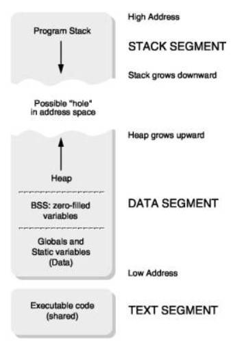
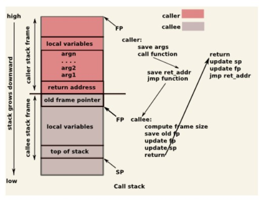

# TP 08 - Communication Entre Processus

## Resources
Fonctions de mappage de la mémoire:
 1. [mmap](https://docs.rs/nix/latest/nix/sys/mman/fn.mmap.html)
 2. [mprotect](https://docs.rs/nix/latest/nix/sys/mman/fn.mprotect.html)
 3. [munmap](https://docs.rs/nix/latest/nix/sys/mman/fn.munmap.html)
Indicateurs de protection de la mémoire:
 1. [ProtFlags](https://docs.rs/nix/latest/nix/sys/mman/struct.ProtFlags.html)
 2. [MapFlags](https://docs.rs/nix/latest/nix/sys/mman/struct.MapFlags.html)


## Gestion de la mémoire

Le système de gestion de la mémoire d'un système d'exploitation est utilisé par tous les autres sous-systèmes: planificateur, E / S, système de fichiers, gestion des processus, mise en réseau. La mémoire est une ressource importante, c'est pourquoi des algorithmes efficaces pour son utilisation et sa gestion sont nécessaires.

Le rôle du sous-système de gestion de la mémoire est de:
* garder une trace des zones de mémoire physique (occupée ou libre)
* pour fournir aux processus ou autres sous-systèmes un accès à la mémoire
* mapper les pages de mémoire virtuelle d'un processus (pages) sur les pages physiques (frames)

Le noyau du système d'exploitation propose un ensemble d'interfaces (appels système) qui permettent l'allocation / partage de mémoire, le mappage de régions de mémoire virtuelle sur des fichiers, le partage de zones de mémoire.

Malheureusement, le niveau limité de compréhension de ces interfaces et des actions qui se produisent derrière elles conduit à un certain nombre de problèmes qui sont couramment rencontrés dans les applications logicielles: fuites de mémoire, accès invalides, écrasement, débordement de tampon, corruption de zone mémoire.

Il est donc essentiel de connaître le contexte dans lequel le sous-système de gestion de la mémoire fonctionne et de comprendre l'interface fournie au programmeur par le système d'exploitation.

## L'espace d'adressage d'un processus
L'espace d'adressage d'un processus ou, mieux encore, l'espace d'adressage virtuel d'un processus est la zone de mémoire virtuelle qu'un processus peut utiliser. Chaque processus a son propre espace d'adressage. Même dans les situations où deux processus partagent une zone mémoire, l'espace virtuel est distinct, mais il est mappé sur la même zone mémoire physique.

La figure suivante montre un espace d'adressage typique pour un processus. Dans les systèmes d'exploitation modernes, dans l'espace virtuel de chaque processus, la mémoire du noyau est mappée, elle peut être mappée au début ou à la fin de l'espace d'adressage. Ensuite, nous ferons uniquement référence à l'espace d'adressage dans l'espace utilisateur pour un processus.

Les 4 zones importantes de l'espace d'adressage du processus sont la zone de données, la zone de code, la pile et le tas. Comme le montre la figure, la pile et le tas sont les zones qui peuvent croître. En fait, ces deux domaines sont dynamiques et n'ont de sens que dans le contexte d'un processus. De l'autre côté, les données dans la zone de données et la zone de code sont décrites dans l'exécutable.



### Zones de données
Les zones de données contiennent les variables globales définies dans un programme et les variables en lecture seule. Il existe plusieurs sous-types de zones de données selon le type de données.

#### .data
La zone `.data` contient les variables globales et les variables statiques **initialized** aux valeurs nulles d'un programme. Par exemple:
```rust
static mut a: u32 = 3;
```

#### .bss
La zone `.bss` contient les variables globales et statiques **initialized** d'un programme. Avant l'exécution du code, ce segment est initialisé avec 0. Par exemple:
```rust
static mut a: u32 = 0;
```
En général, ces variables ne seront pas préallouées dans l'exécutable, mais lors de la création du processus. L'allocation de la zone `.bss` se fait sur des pages mises à zéro.

#### .rodata
La zone `.rodata` contient des informations qui ne peuvent être lues que et non modifiées. Voici les literals **stockés**:
```rust
"Hello, World!"
"En Taro Adun!"
```
Toutes les variables globales déclarées avec le mot-clé `const` seront sont alignées dans leur lieu d'utilisation. Les variables locales déclarées seront placées sur la pile, Un cas particulier est représenté par les variables locales constantes déclarées avec le mot-clé `static` qui seront mises dans le `.data` :

```rust
static mut a: u32 = 0;         /* dans .rodata */
 
fn myfunc()
{
   let a: i32                       /* sur la pile */
   let some_const: u32 = 2;       /* sur la pile */
 
   static mut p: u32 = 8;    /* dans .data */
   static p: u32 = 8;    /* dans .rodata */
   ...
}
```

### Pile
La pile est une région dynamique au sein d'un processus, gérée automatiquement par le compilateur.

La pile est utilisée pour stocker des “cadres de pile”. Un nouveau “cadre de pile” sera créé pour chaque appel de fonction.

Un “cadre de pile” contient:
* variables locales
* arguments de fonction
* adresse de retour

Sur la grande majorité des architectures modernes, la pile croît (des grandes adresses aux petites adresses) et le tas augmente. La pile augmente à chaque appel de fonction et diminue à chaque retour de la fonction.

La figure ci-dessous montre une vue conceptuelle sur la pile lors de l'appel d'une fonction.



### Tas(Heap)
Le tas est la zone de mémoire dédiée à l'allocation dynamique de mémoire. Le segment de mémoire est utilisé pour allouer des régions de mémoire dont la taille est déterminée lors de l'exécution.

Comme la pile, le tas est une région dynamique qui change sa taille. Contrairement à la pile, cependant, le tas n'est pas géré par le compilateur. Il est du devoir du programmeur de savoir combien de mémoire allouer et de se rappeler combien allouer et quand allouer. Les problèmes courants dans la plupart des programmes sont la perte de références aux zones allouées (fuites de mémoire) ou la référence de zones non allouées ou insuffisamment allouées (accès invalides).

Dans des langages comme Java, Lisp, etc. là où il n'y a pas de “liberté de pointeur”, l'effacement de l'espace alloué se fait automatiquement via un garbage collector. Sur ces systèmes, le problème de la perte de références est évité, mais le problème de référence de zones non allouées reste actif.

## Allocation / affectation de mémoire

**L'allocation de mémoire** est effectuée statiquement par le compilateur ou dynamiquement pendant l'exécution. L'allocation statique est effectuée dans des segments de données pour les variables globales ou pour les littéraux.

Lors de l'exécution, les variables sont allouées sur la pile ou dans le tas. L'allocation de pile est automatiquement effectuée par le compilateur pour les variables locales d'une fonction (à l'exception des variables locales préfixées par l'identifiant **statique**).

*L'allocation dynamique* se fait en tas. L'allocation dynamique se produit quand on ne sait pas, au moment de la compilation, combien de mémoire sera nécessaire pour une variable, une structure, un vecteur. Si, au moment de la compilation, on sait combien d'espace une variable occupera, son allocation statique est recommandée, afin d'éviter les erreurs qui se produisent fréquemment dans le contexte de l'allocation dynamique.

Afin de fragmenter le moins possible l'espace d'adressage du processus, à la suite d'allocations et de désallocations de zones de différentes tailles, l'allocateur de mémoire organisera le segment de données alloué dynamiquement en tas , d'où le nom du segment.

**Débordement de mémoire** signifie libérer de la zone de mémoire précédemment allouée (elle est marquée comme libre).

Si le verrouillage d'une zone mémoire est omis, il restera alloué pendant toute la durée d'exécution du processus. Chaque fois qu'une zone mémoire n'est plus nécessaire, elle doit être compensée pour l'efficacité d'utilisation de l'espace mémoire.

Il n'est pas nécessaire de traiter différents domaines avant un appel [exit](https://linux.die.net/man/3/exit) ou avant la fin du programme car ils sont automatiquement libérés par le système d'exploitation.

:::note
Dans la plupart des cas, des problèmes surviennent si vous essayez de colocaliser deux fois la même zone de mémoire. En effet, les données de gestion interne des zones allouées sont corrompues. Habituellement, le noyau signale le problème avec une interruption synchrone.
:::

### Allocation de mémoire sous Linux
Sous Linux, l'allocation de mémoire pour les processus utilisateur se fait via les fonctions de bibliothèque [malloc](https://linux.die.net/man/3/malloc), [calloc](https://linux.die.net/man/3/calloc) et [realloc](https://linux.die.net/man/3/realloc), et sa collocation à travers la fonction [free](https://linux.die.net/man/3/free). Ces fonctions représentent les appels de bibliothèque et résolvent, dans la mesure du possible, l'allocation de mémoire et les demandes d'allocation dans l'espace utilisateur.

## Mémoire virtuelle

:::warning
Vous pouvez trouver dans la section Bibliographie les liens pour les fonctions de Rust qui sont correspondant aux fonctions de C utilisees par Linux. S'il vous plait de les consulter!
:::

Le mécanisme de mémoire virtuelle est utilisé par le cœur du système d'exploitation pour implémenter une politique de gestion de mémoire efficace. Ainsi, bien que les applications utilisent actuellement la mémoire virtuelle, elles ne le font pas explicitement. Cependant, dans certains cas, les applications utilisent explicitement la mémoire virtuelle.

Le système d'exploitation fournit des primitives pour mapper des fichiers, de la mémoire ou des périphériques à l'espace d'adressage d'un processus.

* **Le mappage de fichiers** en mémoire est utilisé dans certains systèmes d'exploitation pour implémenter des mécanismes de mémoire partagée. De plus, ce mécanisme permet d'implémenter la pagination à la demande et des bibliothèques partagées.
* **Le mappage de la mémoire** dans l'espace d'adressage est utile lorsqu'un processus souhaite allouer une grande quantité de mémoire.
* **Le mappage d'appareil** est utile lorsqu'un processus souhaite utiliser directement la mémoire d'un appareil (comme une carte vidéo).

### Concepts théoriques
La taille de l'espace d'adressage virtuel d'un processus dépend de la taille des registres du processeur. Ainsi, sur un système 32 bits, un processus pourra accéder à 2 ^ 32 = 4 Go d'espace mémoire (en revanche, sur un système 64 bits, il accédera théoriquement à 2 ^ 64 B). L'espace mémoire du processus est divisé en un espace réservé aux adresses de noyau virtuel - cet espace est commun à tous les processus - et l'espace d'adressage virtuel (propre) du processus. La plupart du temps, le partage entre les deux est de 3/1 (3 Go d'espace utilisateur contre 1 Go d'espace noyau).

La mémoire physique (RAM) est répartie entre les processus actuellement actifs et le système d'exploitation. Ainsi, selon la quantité de mémoire dont nous disposons sur la machine physique, il est possible d'épuiser toutes les ressources et de ne pas pouvoir démarrer un nouveau processus. Pour éviter ce scénario, le mécanisme de mémoire virtuelle a été introduit. De cette façon, même si l'espace virtuel (composé du segment de texte, de la date, du tas, de la pile) d'un processus est plus grand que la mémoire physique disponible sur le système, le processus pourra s'exécuter en mémoire en ne chargeant que les pages dont il a besoin dans temps d'exécution (paging à la demande).

L'espace d'adressage virtuel est divisé en pages virtuelles (page). Le correspondant de la mémoire physique est la page physique (frame). La taille d'une page virtuelle est égale à celle d'une page physique. La taille est donnée par le matériel (dans la plupart des cas, une page a 4 Ko sur un système 32 bits ou 64 bits).

Tant qu'un processus en cours d'exécution n'accède qu'aux pages résidant en mémoire, il s'exécute comme s'il avait tout l'espace mappé dans la mémoire physique. Lorsqu'un processus souhaite accéder à une certaine page virtuelle, qui n'est pas mappée en mémoire, une erreur de page sera générée, et après cette page manquante, la page virtuelle sera mappée sur une page physique. Deux processus différents ont un espace virtuel différent, mais certaines pages virtuelles de ces processus peuvent être mappées sur la même page physique. Ainsi, deux processus différents peuvent partager la même page physique, mais ne partagent pas de pages virtuelles.

### malloc
Comme nous l'avons trouvé dans la section Allocation de mémoire sous Linux, `malloc` alloue de la mémoire sur le tas, donc dans l'espace virtuel du processus.

L'allocation de mémoire virtuelle se fait au niveau de la page, de sorte que `malloc` alloue réellement le plus petit nombre de pages virtuelles qui composent l'espace mémoire requis. Soit le code suivant:

Rust utilise la fonction `malloc` de la `libc` pour allouer de la mémoire lors de l'utilisation, par exemple, de `Vec::new()`.

```rust
char *p = malloc(4150);
DIE(p == NULL, "malloc failed");
```

Étant donné qu'une page virtuelle a 4KB = 4096 octets, alors l'appel `malloc` allouera 4096 octets + 54 octets = 4KB + 54 octets, espace qui n'est pas contenu dans une seule page virtuelle, de sorte que 2 pages seront allouées virtuel. Au moment de l'affectation avec “malloc” il n'y aura pas de pages allouées (tout le temps) et physiques; ils ne seront alloués que lors de l'accès aux données de la zone de mémoire allouée avec 'malloc'. Par exemple, lors de l'accès à un élément à partir de p, une erreur de page sera générée et la page virtuelle contenant cet élément sera mappée sur une page physique.

:::note
Généralement, sur le petit appel malloc (lorsque l'appel système `brk` est rappelé), la bibliothèque C standard analyse les pages allouées, génère des erreurs de page et lorsque l'appel revient, les pages physiques seront déjà allouées. On peut dire que pour les petites dimensions, l'appel 'malloc', vu depuis l'application (en dehors de la bibliothèque standard C), alloue également des pages physiques et des pages virtuelles.

De plus, l'allocation réelle des pages virtuelles et physiques se produit au moment de l'appel système `brk` . Il alloue un espace plus grand, et les futurs appels `malloc` utiliseront cet espace. De cette façon, les appels “malloc” suivants seront efficaces: ils ne feront pas d'appels système, ils ne feront pas d'allocation efficace d'espace virtuel ou physique, ils ne généreront pas de défauts de page .

L'appel malloc est plus efficace que l'appel calloc car il ne parcourt pas l'espace alloué pour le remplir de zéros. Cela signifie que `malloc` renverra la zone allouée avec les informations qui s'y trouvent; Dans certaines situations, cela peut constituer un risque pour la sécurité - si les données y sont privées.
:::

### Mappage de fichiers
Après avoir mappé un fichier à l'espace d'adressage du processus, l'accès à ce fichier peut se faire de la même manière que l'accès aux données à partir d'un vecteur. L'efficacité de la méthode vient du fait que la zone mémoire est gérée de la même manière que la mémoire virtuelle, soumise aux règles d'évacuation du disque lorsque la mémoire devient insuffisante (de cette façon on peut travailler avec des mappages qui dépassent la taille effective de la mémoire physique). De plus, la partie `I / O` est réalisée par le noyau, le programmeur écrivant du code qui ne récupère / stocke que les valeurs de / dans la région mappée. Ainsi, il n'est plus appelé `read` , `write` , `lseek` - ce qui simplifie souvent l'écriture de code.   

:::warning
Tous les descripteurs de fichiers ne peuvent pas être mappés en mémoire. Les sockets, les tuyaux, les périphériques qui n'autorisent que l'accès séquentiel (par exemple, le périphérique char) sont incompatibles avec les concepts de mappage. Il existe des cas où les fichiers normaux ne peuvent pas être mappés (par exemple, s'ils n'étaient pas ouverts pour plus de lisibilité; pour plus d'informations: **man mmap** ).  
:::

#### mmap
Prototype de fonction mmap qui permet le mappage d'un fichier à l'espace d'adressage du processus est le suivant:
```c
void *mmap(void *start, size_t length, int prot, int flags, int fd, off_t offset);
```

```rust
pub unsafe fn mmap(
    addr: Option<NonZeroUsize>,
    length: NonZeroUsize,
    prot: ProtFlags,
    flags: MapFlags,
    fd: RawFd,
    offset: off_t
) -> Result<*mut c_void>
```

La fonction retournera en cas d'erreur `MAP_FAILED` . Si le mappage a réussi, il renverra un pointeur vers une zone de mémoire dans l'espace d'adressage du processus, la zone où le fichier décrit par le descripteur `fd` a été mappé, en commençant par l'offset. L'utilisation du paramètre `start` vous permet de proposer une zone mémoire spécifique à mapper. L'utilisation de la valeur NULL pour le paramètre start indique l'absence de préférence concernant la zone dans laquelle l'allocation sera effectuée. L'adresse spécifiée par le paramètre start doit être multiple de la taille d'une page . Si le système d'exploitation ne peut pas mapper le fichier à l'adresse requise, il le mappera à un emplacement proche et multiple de *la taille d'une page*. L'adresse la plus appropriée est également retournée.

Le paramètre `prot` spécifie le type d'accès souhaité:
* `PROT_READ` (lire)
* `PROT_WRITE` (écrire)
* `PROT_EXEC` (exécution)
* `PROT_NONE`

Lorsque la zone est utilisée autrement que ce qui est indiqué, un signal `SIGSEGV` est généré.

Le paramètre `flags` vous permet de définir le type de mappage que vous souhaitez; il peut prendre les valeurs suivantes (combinées par OR en bits; il doit y avoir au moins `MAP_PRIVATE` ou `MAP_SHARED` ):

* `MAP_PRIVATE` - Utilisez une politique de copie sur écriture . La zone contiendra initialement une copie du fichier, mais les écritures ne sont pas effectuées dans le fichier. Les modifications ne seront pas visibles dans les autres processus , s'il y a plusieurs processus qui ont fait “mmap” sur la même zone du même fichier.
* `MAP_SHARED` - Les entrées sont mises à jour immédiatement dans tous les mappages existants. De cette façon, tous les processus qui ont effectué des mappages verront les modifications. En effet, les mappages “MAP_SHARED” sont effectués sur les pages physiques du cache de pages et les appels r / w utilisent les pages physiques du cache de pages pour réduire le nombre de lectures / écritures à partir du disque. Les mises à jour du disque auront lieu ultérieurement, sans précision.
* `MAP_FIXED` - Si l'affectation à l'adresse spécifiée par start ne peut pas être effectuée, l'appel échouera.
* `MAP_LOCKED` - Cette page sera bloquée de cette manière [mlock](https://linux.die.net/man/2/mlock).
* `MAP_ANONYMOUS` - Mappe la RAM (les arguments fd et offset sont ignorés).

  Il est à noter que l'utilisation de `MAP_SHARED` permet le partage de mémoire entre des processus qui ne sont pas liés. Dans ce cas, le contenu du fichier devient le contenu initial de la mémoire partagée et toutes les modifications apportées par les processus dans cette zone sont ensuite copiées dans le fichier, garantissant ainsi la persistance dans le système de fichiers.

#### msync
La fonctionnalité est disponible pour déclencher explicitement la synchronisation des fichiers avec le mappage de la mémoire [msync](https://linux.die.net/man/2/msync):
```c
int msync(void *start, size_t length, int flags);
```

```rust
pub unsafe fn msync(
    addr: *mut c_void,
    length: size_t,
    flags: MsFlags
) -> Result<()>
```
où `drapeaux` peut être:
* `MS_SYNC` - Les données seront écrites dans le fichier et attendront jusqu'à ce qu'elles soient terminées.
* `MS_ASYNC` - La séquence de sauvegarde est lancée, mais son achèvement n'est pas prévu.
* `MS_INVALIDATE` - Le mappage de la zone à partir d'autres processus est invalidé, de sorte que les processus seront mis à jour avec les nouvelles données entrées.

L'appel msync est utile pour écrire des pages modifiées du cache de pages sur le disque, afin d'éviter de perdre des modifications en cas de plantage du système.

### Allouer de la mémoire dans l'espace d'adressage du processus
Sous UNIX, traditionnellement, pour l'allocation de mémoire dynamique , l'appel système est utilisé [brk](https://linux.die.net/man/2/brk). Cet appel augmente ou diminue la zone de segment de mémoire associée au processus. Avec la fourniture d'appels du système de gestion de la mémoire virtuelle aux applications ([mmap](https://linux.die.net/man/2/mmap)), il était possible pour les processus d'allouer de la mémoire à l'aide de ces nouveaux appels système. Fondamentalement, les processus peuvent mapper la mémoire à l'espace d'adressage, pas aux fichiers.

Les processus peuvent nécessiter l'allocation d'une zone mémoire à partir d'une adresse spécifique dans l'espace adresse, même avec une certaine stratégie d'accès (lecture, écriture ou exécution). Sous UNIX, cela se fait également via la fonction mmap. Pour cela, le paramètre `flags` doit contenir le flag `MAP_ANONYMOUS` .

### Appareils de cartographie
Il est même possible pour les applications de mapper un périphérique d'entrée-sortie dans l'espace d'adressage du processus. Ceci est utile, par exemple, pour les cartes vidéo: une application peut mapper la mémoire physique de la carte vidéo à l'espace d'adressage. Sous UNIX, les périphériques étant représentés par des fichiers, il suffit pour cela d'ouvrir le fichier associé au périphérique et de l'utiliser dans un appel `mmap` .

:::note
Tous les appareils ne peuvent pas être mappés en mémoire, mais lorsqu'ils sont mappés, l'importance de ce mappage dépend strictement de l'appareil.
:::

Un autre exemple d'un périphérique qui peut être mappé est la mémoire elle-même. Sous Linux, vous pouvez utiliser le fichier `/ dev / zero` pour effectuer le mappage de la mémoire, comme si vous utilisiez l'indicateur `MAP_ANONYMOUS` .

### Suppression d'une zone de l'espace d'adressage

Si vous souhaitez effacer une zone de l'espace d'adressage du processus, vous pouvez utiliser la fonction [munmap](https://linux.die.net/man/3/munmap):

```c
 int munmap(void *start, size_t length);
```
```rust
pub unsafe fn munmap(addr: *mut c_void, len: size_t) -> Result<()>
```

`addr` est l'adresse de la première page à délimiter (doit être multiple de la taille d'une page ). Si la `longueur` n'est pas une taille qui représente un nombre entier de pages, elle sera arrondie plus haut. La zone peut contenir des pièces qui ont déjà été supprimées. Vous pouvez ainsi effacer plusieurs zones en même temps.

### Redimensionner une zone mappée
La fonction peut être utilisée pour effectuer des opérations de redimensionnement de la zone de mappage [mremap](https://linux.die.net/man/2/mremap):

```c
void *mremap(void *old_address, size_t old_size, size_t new_size, unsigned long flags);
```

```rust
pub unsafe fn mremap(
    addr: *mut c_void,
    old_size: size_t,
    new_size: size_t,
    flags: MRemapFlags,
    new_address: Option<*mut c_void>
) -> Result<*mut c_void>
```
La zone décrite par `addr` et `old_size` doit appartenir à un seul mappage. Une seule option est disponible pour les `indicateurs` : `MREMAP_MAYMOVE` qui montre qu'il est correct d'obtenir le nouveau mappage pour effectuer un nouveau mappage dans une autre zone de mémoire (l'ancienne zone étant floue).

### Modifier la protection d'une zone cartographiée

Parfois, il est nécessaire de changer la façon (droits d'accès) dans laquelle une zone a été cartographiée. Pour cela, vous pouvez utiliser la fonction [mprotect](https://linux.die.net/man/2/mprotect):

```c
int mprotect(const void *addr, size_t len, int prot);
```

```rust
pub unsafe fn mprotect(
    addr: *mut c_void,
    length: size_t,
    prot: ProtFlags
) -> Result<()>
```
La fonction reçoit comme paramètres la plage d'adresses [ `addr` , `addr + length - 1`] et de nouveaux droits d'accès ( `PROT_READ` , `PROT_WRITE` , `PROT_EXEC` ,`PROT_NONE`). Comme dans munmap, `addr` doit être multiple de la taille de la page . La fonction modifiera la protection de toutes les pages contenant au moins un octet dans la plage spécifiée.

## Exercises
1. Exécutez le programme dans ex1. Répondez aux questions posées par le programme.
2. Résolvez les lignes TODO (dans l'ordre) à partir de ex1.
3. Résolvez les lignes TODO (dans l'ordre) de ex2.
4. Résolvez les lignes TODO (dans l'ordre) de ex3.
